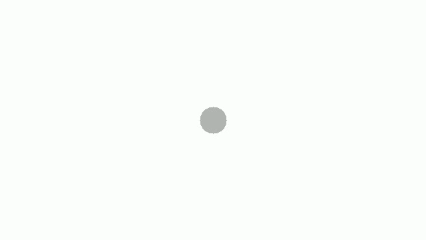
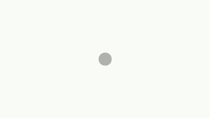

# Video-Super-Resolution_Frame-Interpolation

---

## 1. 프로젝트 개요

본 프로젝트는 저화질 영상을 입력으로 받아 프레임 보간을 통해 60fps로 변환하고, 이후 AI 기반 업스케일링을 적용하여 영상을 개선하는 것을 목표로 한다.

본 연구의 핵심은 단순히 화질을 극대화하는 것이 아니라, 프레임 또한 보간해 시각적인 요소를 확보하는것이다.

본 프로젝트는 이론적으로 가장 높은 성능보다는 실제 환경에서 사용 가능한 AI 영상 처리 시스템을 지향한다.

> 프레임 보간 gif\
> \
> 30fps\
> \
> 60fps\
> \
> 위 : 30fps 아래 : 60 fps 사용하는 모니터에 따라 다를 수 있음.

---

## 2. 데이터 수집 및 모델 확보
[Real_ESRGAN](https://github.com/xinntao/Real-ESRGAN) 업스케일링 모델 \
[vimeo90k](https://cove.thecvf.com/datasets/875) 프레임 보간 모델 학습 데이터

---

## 3. 프레임 보간 기법 (VFI)

프레임 보간 단계에서는 앞뒤로 이어진 두 장의 영상을 이용해, 그 사이에 들어갈 중간 화면을 하나 더 만들어낸다.

두 프레임을 하나로 합쳐서 입력한 뒤, 모델이 자연스러운 중간 장면이 어떤 모습일지를 예측하도록 했다.

복잡한 움직임을 계산하는 방식 대신, 화면의 변화를 전체적으로 학습하는 구조를 사용했기 때문에 처리 속도가 빠르고 구현이 단순하다는 장점이 있다.

> 1. 첫번째 프레임 2. ai 예측 3. 정답 4.두번쨰 프레임
> 

---

## 4. 해상도 업스케일링 기법 (Real-ESRGAN)

업스케일링 단계에서는 Real-ESRGAN의 x2 모델을 사용하였다.

초기 실험에서는 x4 모델을 사용하였으나, 처리 시간이 과도하게 증가하여  처리가 어렵다는 문제가 있었다.

이에 따라 본 프로젝트에서는 화질과 처리 속도 간의 균형을 고려하여 x2 업스케일링 방식을 채택하였다.

> 1.처리 전 
>  \
> 2.처리 후
> 빨간 차를 자세히 보면 좀 선명해진걸 알 수 있다.
---

## 5. 처리 순서에 대한 비교 실험

본 프로젝트에서는 다음 두 가지 처리 순서를 비교하였다.

- 프레임 보간 → 업스케일링 약 27분
- 업스케일링 → 프레임 보간 약 14분

실험 결과, 업스케일링을 먼저 수행한 뒤 프레임 보간을 적용하는 방식이 전체 처리 시간과 안정성 측면에서 더 효율적인 결과를 보였다.

프레임 보간으로 인해 처리해야 할 프레임 수가 증가하고, 이로 인해 연산 비용이 큰 업스케일링 단계에서 병목 현상이 발생하여 전체 처리 속도가 느려진다.
프레임 보간만 시행시 약 30초 영상을 26초정도 만에 완료함

---

## 6. 실험 환경

본 프로젝트의 실험 환경은 다음과 같다.

- GPU: NVIDIA RTX 4060
- Framework: PyTorch
- Video Processing: OpenCV
- Super Resolution Model: Real-ESRGAN x2

>absl-py==2.3.1
addict==2.4.0
basicsr==1.4.2
certifi==2025.10.5
charset-normalizer==3.4.4
colorama==0.4.6
contourpy==1.3.2
cycler==0.12.1
facexlib==0.3.0
ffmpeg-python==0.2.0
filelock==3.20.0
filterpy==1.4.5
fonttools==4.60.1
fsspec==2025.9.0
future==1.0.0
gfpgan==1.3.8
grpcio==1.75.1
idna==3.11
imageio==2.37.0
Jinja2==3.1.6
kiwisolver==1.4.9
lazy_loader==0.4
llvmlite==0.45.1
lmdb==1.7.5
Markdown==3.9
MarkupSafe==3.0.3
matplotlib==3.10.7
mpmath==1.3.0
networkx==3.4.2
numba==0.62.1
numpy==1.26.4
opencv-python==4.12.0.88
packaging==25.0
pillow==12.0.0
platformdirs==4.5.0
protobuf==6.33.0
pyparsing==3.2.5
python-dateutil==2.9.0.post0
PyYAML==6.0.3
requests==2.32.5
scikit-image==0.25.2
scipy==1.15.3
six==1.17.0
sympy==1.14.0
tb-nightly==2.21.0a20251020
tensorboard-data-server==0.7.2
tifffile==2025.5.10
tomli==2.3.0
torch==1.13.1+cu117
torchaudio==0.13.1+cu117
torchvision==0.14.1+cu117
tqdm==4.67.1
typing_extensions==4.15.0
urllib3==2.5.0
Werkzeug==3.1.3
yapf==0.43.0
> CUDA 버전은 12.5

---

## 7. 결론

본 프로젝트를 통해 저해상도 영상의 해상도와 프레임 수를 동시에 개선할 수 있음을 확인하였다.

단순한 보간 방식 대비 AI 기반 접근 방식은 시각적으로 더 자연스러운 결과를 제공하였으며, 처리 속도 또한 현실적인 수준을 유지하였다.

향후에는 프레임 보간 모델의 품질 개선이나 스트리밍 기반 처리 방식을 도입하여 추가적인 성능 향상을 시도할 수 있을 것으로 판단된다.

[Lossless Scaling(LS)](https://store.steampowered.com/app/993090/Lossless_Scaling/)을 목표로 개발을 진행하였으나, 분석 결과 LS는 실시간으로 고비용의 딥러닝 추론을 수행하는 방식이 아니라, 사전에 딥러닝으로 학습된 패턴을 경량화하여 제한적으로 적용하는 구조임을 확인하였다. 이에 따라 현재 진행 중인 프로젝트 역시 구조를 일부 수정할 경우, LS와 유사한 방식으로 구현이 가능할 것으로 판단된다.

> 실제 사용 이미지  \
> \
> 사진을 넣고 업로드 한다.\
> \
> ai 변환 버튼을 누른다.\
> \
> 결과 : 자세한 사항은 [시연 영상](https://youtu.be/7LBT1xtK4bQ?si=-EqU1U9jbezm2DM0) 시청
